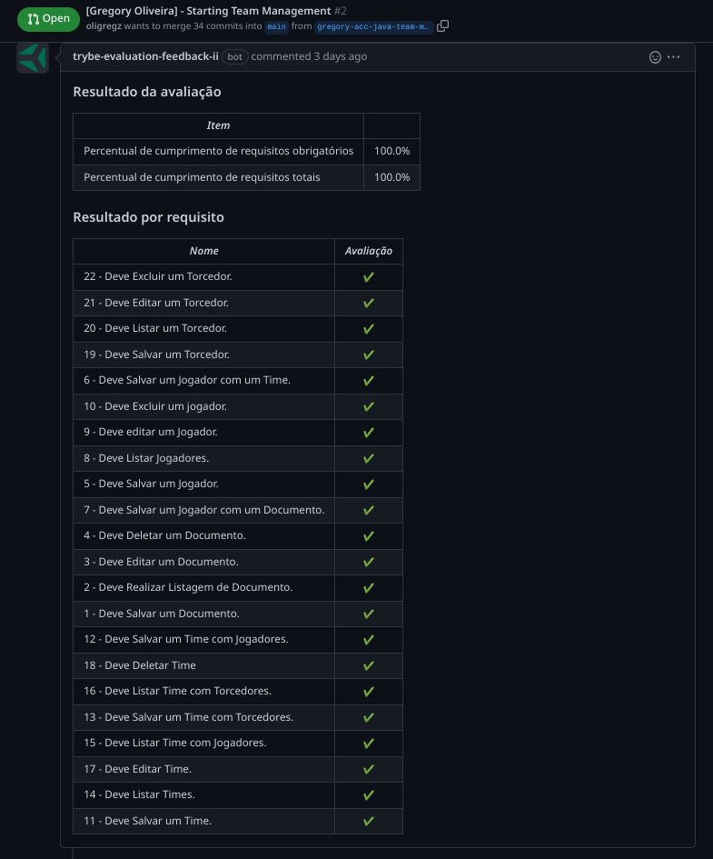

#  Team Managemet API

<strong>🤷 About the API</strong>
 

- This is a Rest API for managing teams, players, fans and documents developed in JAVA and Hibernate.

- This application was developed during the "JAVA Acceleration program (by Trybe ft. Hub Floripa)"for students or graduates at Trybe.

- The API was developed oriented to tests (implemented by Trybe) as a form of evaluation.

 
<strong>Table Relationship Schema</strong>
 

 

 
<strong>Compliance with Approval Requirements</strong>
 

 